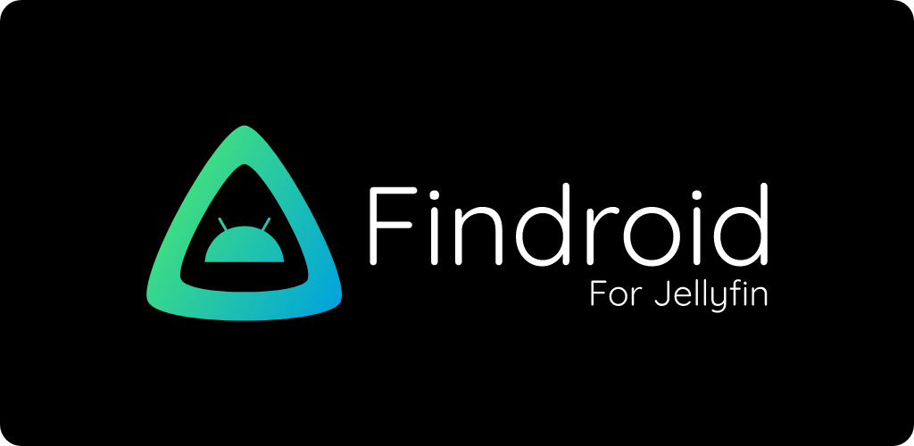
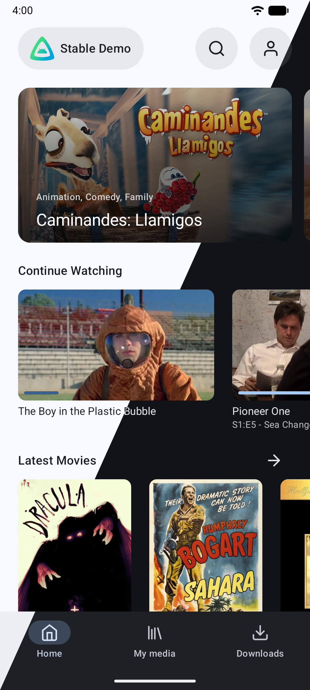
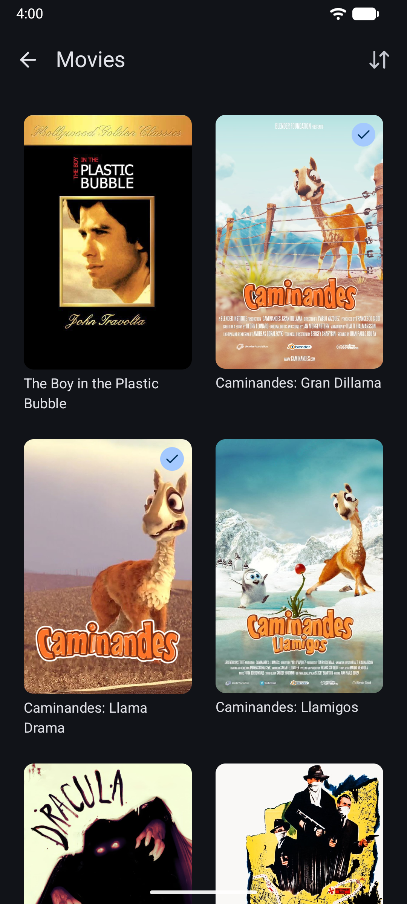
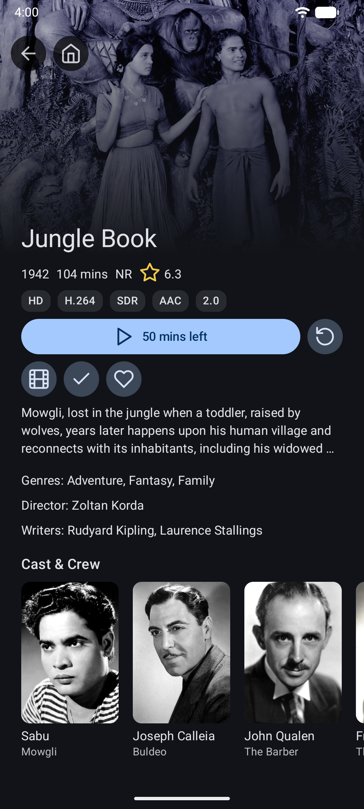
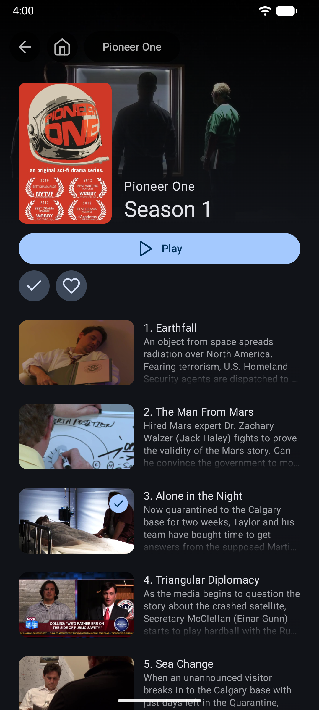
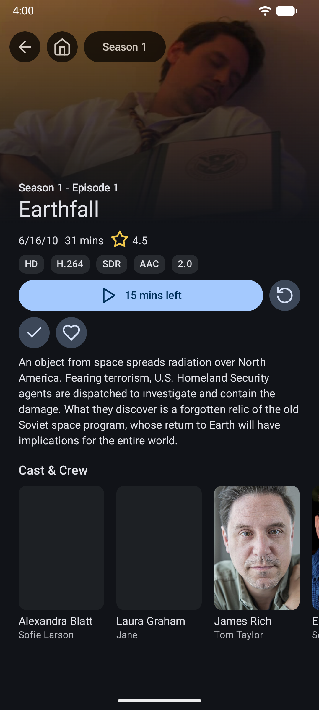

# Curated App

Curated App is a native Android client for the Curated media server, providing a clean interface to browse and play movies and series.

**This project is in its early stages so expect bugs.**

## Screenshots
| Home                                | Library                             | Movie                           | Season                            | Episode                             |
|-------------------------------------|-------------------------------------|---------------------------------|-----------------------------------|-------------------------------------|
|  |  |  |  |  |

## Features
- Completely native interface
- Supported media items: movies, series, seasons, episodes 
  - Direct play only, (no transcoding)
- Offline playback / downloads
- ExoPlayer
  - Video codecs: H.263, H.264, H.265, VP8, VP9, AV1 
    - Support depends on Android device
  - Audio codecs: Vorbis, Opus, FLAC, ALAC, PCM, MP3, AAC, AC-3, E-AC-3, DTS, DTS-HD, TrueHD 
    - Support provided by ExoPlayer FFmpeg extension
  - Subtitle codecs: SRT, VTT, SSA/ASS, PGSSUB
    - SSA/ASS has limited styling support see [this issue](https://github.com/google/ExoPlayer/issues/8435)
- mpv
  - Container formats: mkv, mov, mp4, avi
  - Video codecs: H.264, H.265, H.266, VP8, VP9, AV1
  - Audio codecs: Opus, FLAC, MP3, AAC, AC-3, E-AC-3, TrueHD, DTS, DTS-HD
  - Subtitle codecs: SRT, VTT, SSA/ASS, DVDSUB
  - Optionally force software decoding when hardware decoding has issues.
- Picture-in-picture mode
- Media chapters
  - Timeline markers
  - Chapter navigation gestures
- Trickplay (requires Jellyfin 10.9 or higher)
- Media segments (requires Jellyfin 10.10 or higher)
  - Skip button
  - Auto skip

## Planned features
- Android TV
- Websocket connection (Syncplay)
- Chromecast support

## Translating

Translations are maintained in the project's resource files.

## Questions?

Open an issue on the [GitHub repository](https://github.com/wujiahui/curated-droid).

## License
This project is licensed under [GPLv3](LICENSE).

The logo is a combination of the Jellyfin logo and the Android robot.

The Android robot is reproduced or modified from work created and shared by Google and used according to terms described in the Creative Commons 3.0 Attribution License.

Android is a trademark of Google LLC.

Google Play and the Google Play logo are trademarks of Google LLC.
